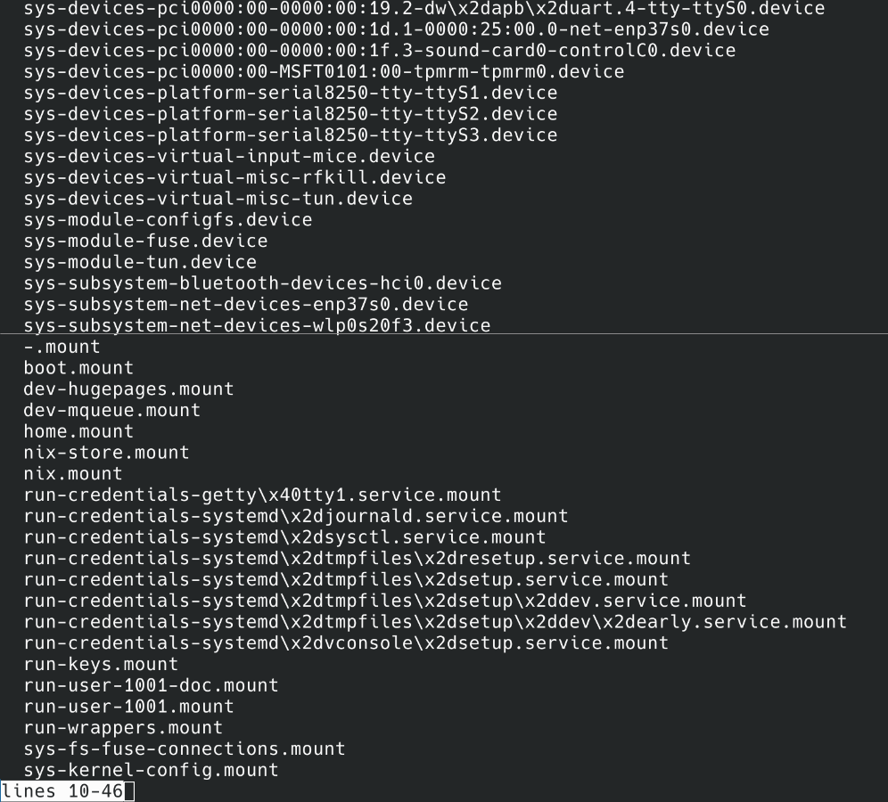
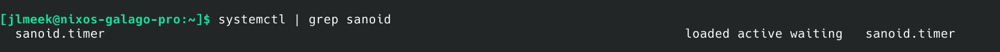
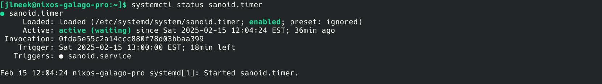
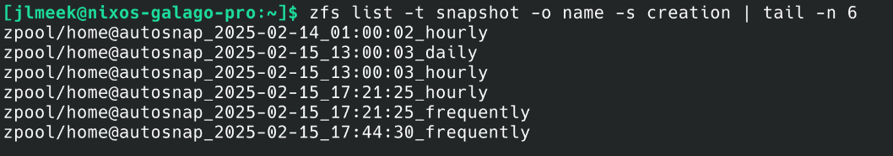

+++
author = "Jonathan L Meek"
title = "Fast Learn: Firing Off Sanoid Systemd Service"
date = "2025-02-15"
description = "How to run sanoid systemd service as a one-off"
toc = false
tags = [
    "nixos",
    "how-to",
    "sanoid",
    "systemd",
    "fast learn"
]
+++
Every so often, I managed to figure out something random in a fast way so I figured it might be valuable to document on the blog when I have a fast learn.

Today's fast learn was determined by the following use case: I have ZFS on my laptop and before shutting down I like to do a snapshot so I can quickly do backups from said snapshot. While I know I can manually create a snapshot using the `zfs` command, I wanted a way that would keep my snapshots consistent without having to write another script.

Off to poke around in my system.

Alright so I know systemd is doing the triggers for timers and controls the daemons on my laptop (Don't @ me, I don't want to hear about the rights/wrongs of systemd. I am just trying to do a thing). So lets get a list of the daemons running

```sh
systemctl
```


Oof, that's a long list. Let me see what happens when add a grep for `sanoid`
```sh
systemctl | grep sanoid
```



Ah much better! I only see the `sanoid.timer` so I could investigate that and see what command it triggers since I am aware that `.timer` in systemd works like `cron` in the non-systemd world (Again don't @ me about systemd/non-systemd, I don't care).

I recall from getting the commands wrong to see the status of something on systemd its `systemctl status <service name>` so maybe `systemctl status sanoid.timer` will give me what I want

```sh
systemctl status sanoid.timer
```



Yep! it shows the setup of the timer and what service it triggers. So can I just trigger the service ad-hoc? I mean I should be able to right.

```sh
systemctl start sanoid.service
```

Yep! that worked and I got my desired snapshot formatted as I wanted (the last 3 snapshots were me running `systemctl start sanoid.service` instead of letting the system do its thing on a timer)



So hopefully this is helpful to someone out there for a quick how-to and might keep doing the fast learns as part of an infrequent blog series.
